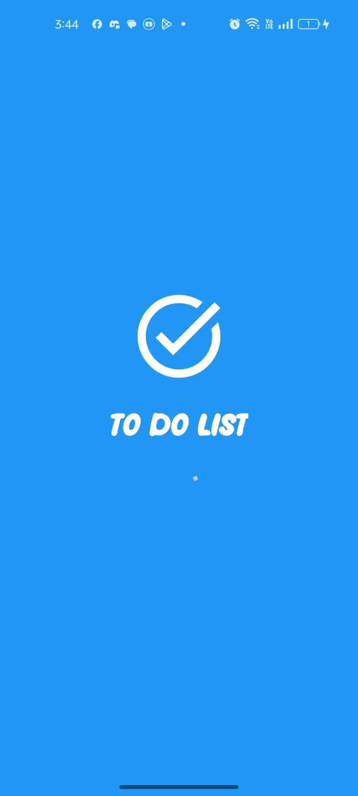
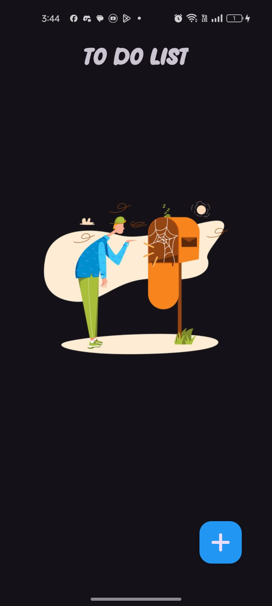
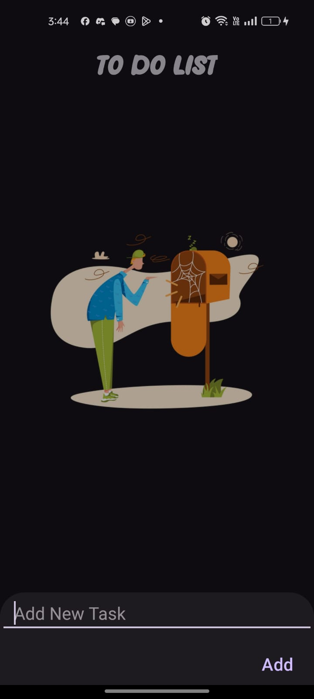
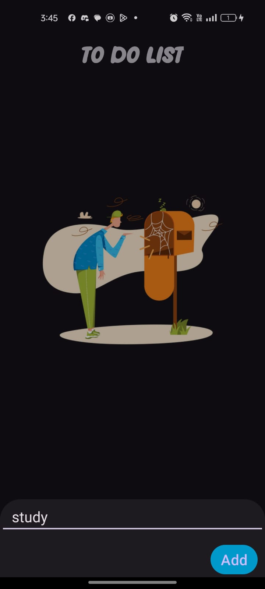
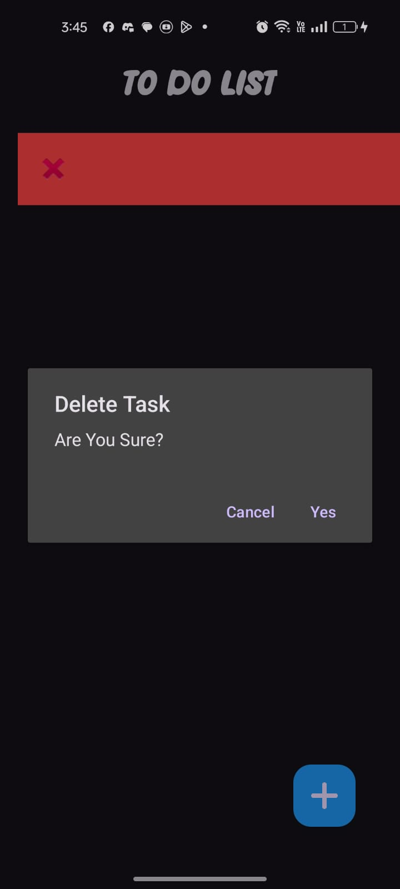
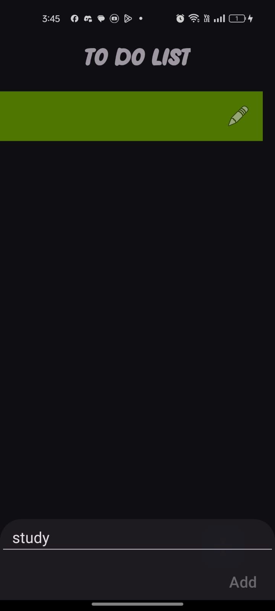

# To-Do List App
- Clean and intuitive UI for focused task management
- Organize your life and boost productivity
- Built with Android and Kotlin for optimal performance

## Screenshots
 {: width="30%"}
 {: width="30%"}

 <h3>Add Task</h3>  

{: width="30%"}
{: width="30%"}

